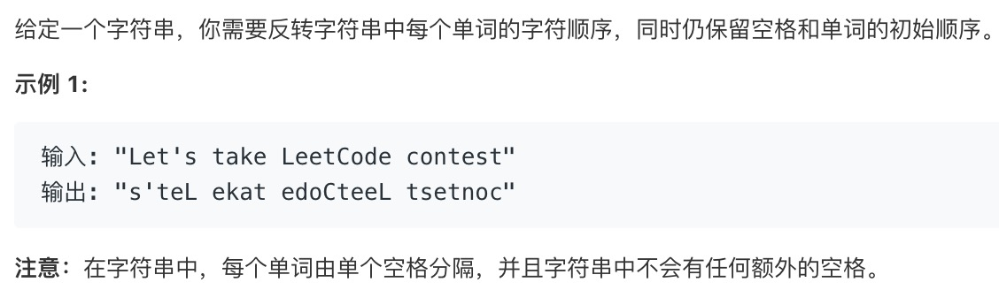
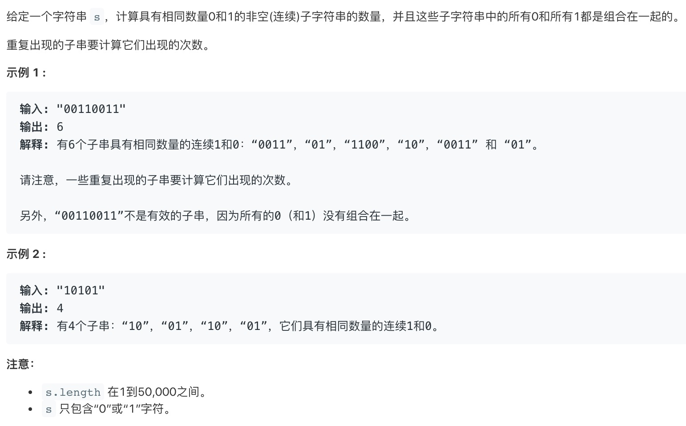
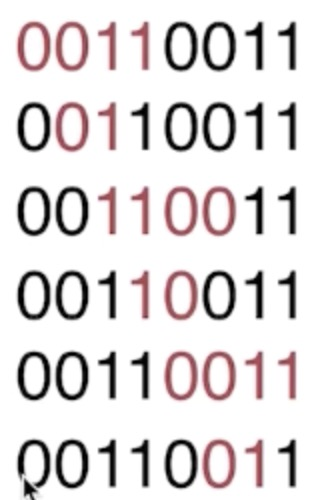

# 字符串算法

## 一：反转字符串中的单词 III

[题目LeetCode地址](https://leetcode-cn.com/problems/reverse-words-in-a-string-iii/submissions/)




这道题目考察得很简单，我们可以很快得读懂题目得意思并拆分解题步骤：

1. 将字符串根据空格分割成数组
2. 将数组的每个元素倒置
3. 将数组转换为字符串

具体实现如下：

```JavaScript
/**
 * @param {string} s
 * @return {string}
 * split()方法的参数必须
 */
const reverseWords = function(s) {
  let arr = s.split(' '); // 根据空格分割字符串
  let result = arr.map(item => {
    return item.split('').reverse().join('');
  });
  return result.join(' ');
};

// 上面的实现过程简化后是这样的：
const reverseWords = function(s) {
  return result = s.split(' ').map(item => {
    return item.split('').reverse().join('');
  }).join(' ');
};
```

上面的实现方法主要使用了split()，我们同时也可以配合正则和其他api使用:
```js
const reverseWords = function(s) {
    // 使用正则，\s表示空格 g表示全部
  return result = s.split(/\s/g).map(item => {
    return item.split('').reverse().join('');
  }).join(' ');
};

const reverseWords = function(s) {
    // 使用正则，\w表示单次，'这个表示字符串中可能存在的特殊字符
  return result = s.match(/[\w']+/g).map(item => {
    return item.split('').reverse().join('');
  }).join(' ');
};
```


这个题目主要考察了我们对以下几个api的用法

```js
String.prototype.split()  // 方法用于把一个字符串分割成字符串数组
String.prototype.match() // 方法可在字符串内检索指定的值，或找到一个或多个正则表达式的匹配
Array.prototype.map() // 方法返回一个新数组，数组中的元素为原始数组元素调用函数处理后的值 / 不会对空数组进行检测 并且不会改变原始数组。
Array.prototype.reverse() // 将数组反转
Array.prototype.join() // 将数组根据特定的字符串重新连接成字符串
```


## 二：计数二进制子串

[题目LeetCode地址](https://leetcode-cn.com/problems/count-binary-substrings/)




这个题目比之前那个道要难一点，我们需要找到明白以下几个问题：
1. 算法的本质是寻找规律并实现
2. 如何找到规律？—— 发现输入和输出的关系，寻找突破点
3. 算法的实现是程序+数据结构的结合体

所以我们再来看下这个题目，可以得出这个题目的规律（根据题目给出的示例和结果套出可能的情况）：



从上图我们能得出的规律是：

先找到第一个符合条件的子串，每找到一个结果，下标就下移一位，并把下一个字符串做为一个新的字串来重复查找。
所以这里可以想到用递归来解决。

```js
/**
 * @param {string} s
 * @return {number}
 */
const countBinarySubstrings = function(s) {
    for(let i = 0; i < s.length - 1; i++) {
        
    }
};
```