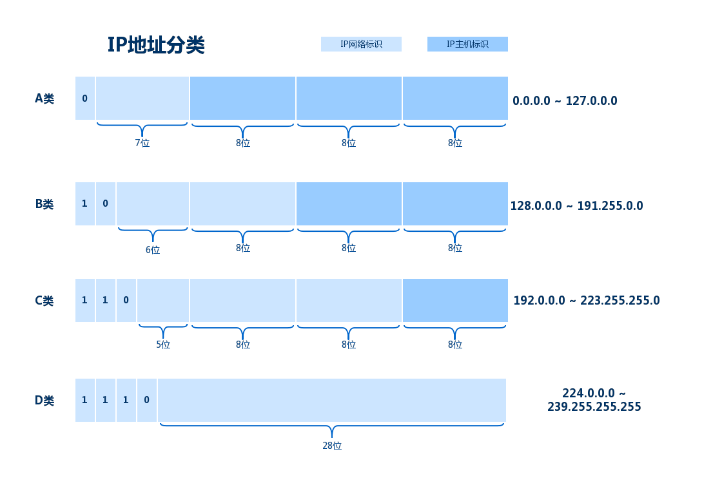

# IP协议 （Internet Protocol）

IP是整个TCP/IP中非常重要的一个协议，主要负责将数据包发送给最终的目标计算机，位于网络层。

IP地址（IPv4地址），由32位正整数来表示，IP地址由 `网络标识`和`主机标识`两部分组成。

## 一. IP地址的分类
IP地址分为四个级别，A / B / C / D 4个类，基本结构如下图所示：
</img>

要注意的是：在分配IP地址时，要用比特位表示主机地址时，不可以全部为0或者全部为1，因为全部为0只有在表示对应的网络地址或IP地址不可获知的情况下才使用，而全部为1的主机地址通常作为广播地址。

## 二. 广播地址

广播地址用于在同一个链路中相互连接的主机之间发送数据包，将IP地址的主机地址部分全部设置为1，就成为了广播地址。
而广播分为：
* 本地广播 —— 在本网络内的广播
* 直接广播 —— 在不同网络之间的广播

⚠️ 广播无法穿透路由

## 三. IP多播

多播用于将包发送给特定组内的主机，由于其直接使用IP协议，所以不存在可靠传输。
多播使用D类地址
 

## IPv6 

IPv6是为了根本解决IPv4地址耗尽的问题而被标准化的网际协议。
IPv4的地址长度一般为4个8位字节，即32bit，而IPv6的地址长度是原来的4倍，即128bit，一般写成8个16位字节。
