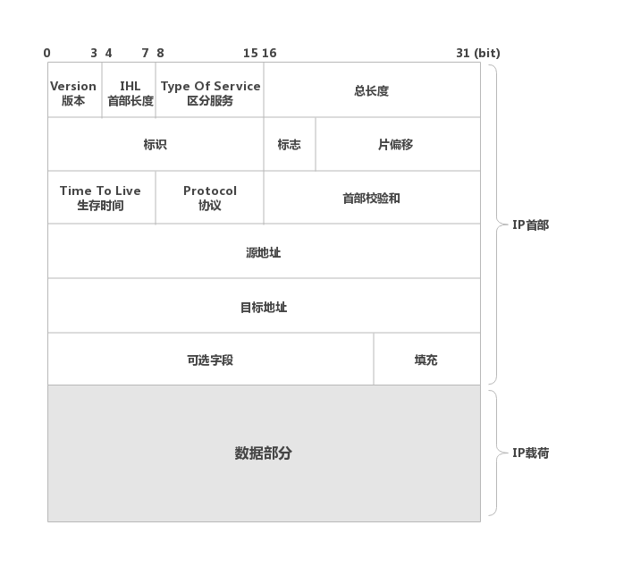
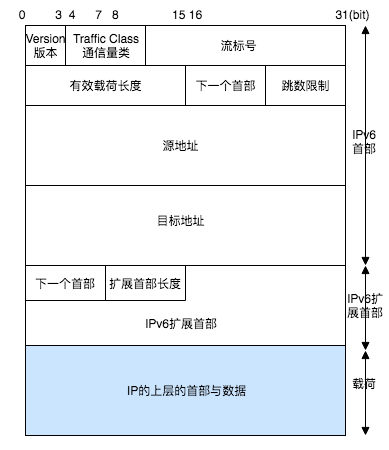
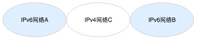

# IP协议 （Internet Protocol）

IP协议是整个TCP/IP中非常重要的一个协议，主要负责将数据包发送给最终的目标计算机，位于网络层。

IP地址（IPv4地址），由32位正整数来表示，IP地址由 `网络标识`和`主机标识`两部分组成。

## 一. IP地址的分类
IP地址分为四个级别，A / B / C / D 4个类，基本结构如下图所示：
</img>

要注意的是：在分配IP地址时，要用比特位表示主机地址时，不可以全部为0或者全部为1，因为全部为0只有在表示对应的网络地址或IP地址不可获知的情况下才使用，而全部为1的主机地址通常作为广播地址。

## 二. IPv4结构

IPv4的数据包基本结构如下图所示：
</img>

可以看到IPv4数据包主要由两部分组成：`IP首部 / IP载荷`（即数据）。
而在IP首部中，有很多的信息：

1. **版本**： 该信息长度为`4bit`，表示标识IP首部的版本号，IPv4的版本号即为4，所以在这个字段上的值也是4，而IP其实是有很多版本的，不同的值表示不同的IP版本，比如我们知道的IPv6的版本号为6。
2. **首部长度**（IHL - Internet Header Length）：长度为`4bit`，表示IP首部的大小，在表示IP首部的大小时，它的单位为 `4字节，即32bit`，即每个数值代表4字节，对于没有可选项的IP包，可选项一般设为`5`，也就是说，当没有可选项时，IP包的首部长度为`5*4=20字节`。而4bit的取值范围为`0-15`，所以首部长度最大可以设为`15`，所以首部长度最大可以是`4*15=60字节`。
3. **区分服务**（TOS - Type Of Service）：长度为8bit，用来表明服务质量。
4. **总长度**：表示IP数据包（IP首部+数据部分）的长度，长度为`16bit`，所以IP数据包的最大长度为`2的16次方 = 65535字节`。
5. **标识**：长度为16bit，用于分片重组，同一个分片的标识值相同，不同分片的标识值不同，但是如果分片的标识值相同，但是目标地址 / 源地址 / 协议不同的话，也是不同的分片。
6. **标志**：长度为3bit，表示包被分片的相关信息。
7. **片偏移**：长度为13bit，用来标识被分片的每一个分段相对于原始数据的位置。
8. **生存时间**：长度为8bit，它最初的意思是以秒为单位记录当前包在网络上应该生存的时限，然后在实际中它指可以中转多少个路由器的意思，每经过一个路由器，TTL会减少1，直到变成0则丢弃该包。
9. **协议**：长度为`8bit`，表示的是ip包传输层的上层协议编号。
10. **首部校验和**：长度为`16bit`，该字段只校验数据报的首部，不校验数据部分，主要用来确保IP数据报不被破坏。
11. **源地址**：32bit，表示发送端ip地址。
12. **目标地址**：32bit，表示接收端ip地址。
13. **可选项**：长度可变，一般只在实验和诊断的时候使用。
14. **填充**：在有可选项的情况下，首部长度可能不是32bit的整数倍，所以通过向字段填充0，调整为32bit的整数倍。
15. **数据**：存入数据。

## 三. 广播地址

广播地址用于在同一个链路中相互连接的主机之间发送数据包，将IP地址的主机地址部分全部设置为1，就成为了广播地址。
而广播分为：
* 本地广播 —— 在本网络内的广播
* 直接广播 —— 在不同网络之间的广播

⚠️ 广播无法穿透路由

## 四. IP多播

多播用于将包发送给特定组内的主机，由于其直接使用IP协议，所以不存在可靠传输。
多播使用D类地址
 

## 五. IPv6 

IPv6是为了根本解决IPv4地址耗尽的问题而被标准化的网际协议。
IPv4的地址长度一般为4个8位字节，即32bit，而IPv6的地址长度是原来的4倍，即128bit，一般写成8个16位字节。

IPv6数据首部格式如下图所示：
</img>

1. **版本**：同IPv4的版本示意，这里的值为6。
2. **通信量类**：相当于IPv4的Type Of Service字段。
3. **流标号**：长度为20bit，暂未使用，准备用于服务质量控制，只有在流标号，源地址，目标地址完全一致时，才认为它们时一个流。
4. **有效载荷长度**：即数据包的数据部分的长度。
5. **下一个首部**：相当于IPv4中的协议字段，长度为8bit，通常表示IP的上一层协议是TCP或UDP。
6. **跳数限制**：长度为8bit，和IPv4中的TTL含义相同，数据每经过一次路由器就减一，减到0丢弃。
7. **IPv6扩展首部**：IPv6的首部固定，无法将可选项加入其中，取而代之的是通过扩展首部对功能进行扩展。

## 六. IP协议相关技术

1. **ARP ( Address Resolution Protocol )** —— ARP是以目标IP地址为线索，用来定位下一个应该接收数据分包的网络设备对应的MAC地址，如果目标主机不在同一个链路上时，可以通过ARP查找下一跳路由器的MAC地址。⚠️ARP只适用于IPv4，不可用于IPv6，在IPv6中可以用ICMPv6代替。
2. **RARP ( Reverse Address Resolution Protocol )** —— 就是将ARP反过来，从MAC地址定位到IP地址的一种协议。
3. **ICMP** —— 确认IP包是否成功送达目标地址，通知在发送过程中IP包被废弃的具体原因，改善网络设置等。主要应用场景为：一个刚建立好的网络，我们需要验证该网络的设置是否正确，并且在网络遇到问题的时候立即制止，并报告出来。

前面说到的IPv6中的ARP代替协议 `ICMPv6`，包含了ARP，ICMP的作用，在IPv6中，如果没有ICMPv6，IPv6就无法正常通信。

4. **DHCP ( Dynamic Host Configuration Protocol )** —— 动态主机配置协议，实现自动设置IP地址，统一管理IP地址分配，
5. **IP隧道** —— 在如下图的一个网络环境里，网络AB使用IPv6，中间位的C网络使用ipv4，这样AB网络将无法直接通信，而IP隧道就是解决不同网络间正常通信的问题。
</img>
IP隧道中可以将哪些从网络A发过来的IPv6包统合为一个数据，再为之追加一个IPv4的首部以后转发给网络C。
本来紧跟IP网络首部的是TCP或UDP的首部，然而现在情况是IP首部的后面是IPv6首部。
