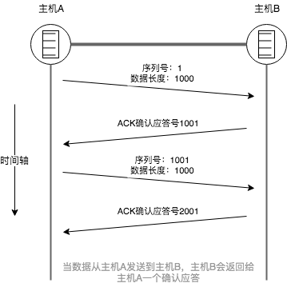

# TCP与UDP

在TCP/IP中能够实现传输层功能的协议中，最具代表性的协议是TCP/UDP。
TCP提供可靠的通信传输，而UDP则常被用于让广播和细节控制交给应用的通行传输。

## 一.TCP 

TCP是`面向连接的`、`可靠`的流协议。（流指不间断的数据结构）,TCP提供可靠传输的方式是实行“顺序控制”或“重发控制”机制，还有流量控制、拥塞控制等功能。

TCP可以进行丢包时的重发控制，还可以对次序乱掉的分包进行顺序控制，TCP作为一种面向有连接的协议，只有在确认通信对端存在时才会发送数据，从而可以控制通信的流量，避免浪费。

TCP通过`校验和`、`序列号`、`确认应答`、`重发控制`、`连接管理`以及`窗口控制`等机制实现可靠性传输。

以下图表示TCP通过序列号与确认应答提高可靠性：

</img>

1. **ACK** —— 在TCP中，当发送端的数据到达接收主机时，接收端主机会返回一个已收到消息的通知，这个消息叫ACK（Positive Acknowledgement），TCP通过ACK实现可靠的数据传输，当发送端将数据发出之后等待对端的确认应答，如果有确认应答，说明数据已经成功到达对端，反之则说明数据丢失的可能性很大。
而如果在一定时间段内没有收到确认应答，发送端就可以认为数据以及丢失，并进行重发，这样的话即时发生了丢包，也仍然可以保证数据可以到达对端，实现数据的可靠传输。

如果出现了丢包的情况，源发送主机只要按照机制重发数据即可，但是对于目标主机来说，他会反复收到相同的数据，而为了对上层应用提供可靠的传输，必须放弃重复的数据包，所以这就有了序列号机制的出现。

2. **序列号** —— 序列号是按照顺序给发送数据的每一个字节（8位字节）都标上编号，接收端查询接收数据TCP首部中的序列号和数据的长度，将自己下一步应该接收的序号作为ACK返回给发送端。

所以，通过序列号和ACK，TCP就可以实现可靠的数据传输。

而我们说到的重发超时是什么呢？

3. **重发超时** —— 重发超时是指在重发数据之前，等待ACK到达的那个时间间隔，如果超过了这个时间仍未收到ACK，发送将进行数据重发。
而重发时间的确定是怎么来的呢？比较理想的是，找到一个最小时间，这个时间可以保证“确认应答一定能在这个时间内返回”，但是这个时间的长短应该随着数据包途经的网络环境不同而有所变化。

## 二.UDP
UDP是不具有可靠性的数据报协议。利用IP提供面向无连接的通信服务，并且它是将应用程序发来的数据在收到的那一刻立刻按照原样发送到网络上的一种机制。
换句话说，它将部分控制转移给应用程序去处理，自己只提供作为传输层协议的最基本功能。
在UDP的情况下，虽然可以保证发送消息的大小，但是却不能保证消息一定会到达，因此，应用有时会根据自己的需要进行重发处理。

由于UDP面向无连接，它可以随时的发送数据，所以经常用在下面几个方面
* 包总量比较少的通信（DNS，SNMP等）
* 视频，音频等多媒体通信（即时通信）
* 广播通信（广播，多播）
