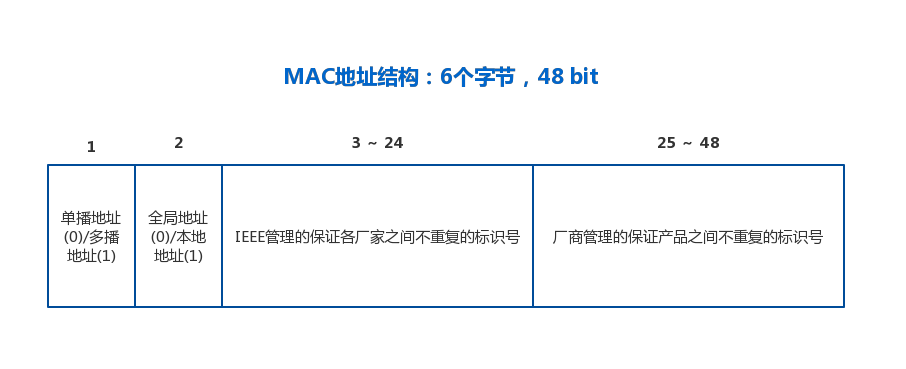

# 数据链路层

数据链路层的协议定义了通过通信媒介互连的设备之间的传输的规范
我们知道计算机的用二进制 0，1 来表示信息，而通信媒介的是用电压的高低，光的闪灭，电波的强弱等信号来表示信息。

所以物理层的功能是 进行通信媒介和二进制 0，1 之间的相互转化。

**数据链路层的功能则是将 0，1 序列集合成“帧”，然后传输给下一层。**

## 数据链路层的相关技术

1. **MAC 地址 —— 下图是 MAC 地址的数据格式**

</img>

2. **共享介质型网络**

从通信介质的使用方法上看，网络可以分成：

- 共享介质型 —— 多个通信设备共享一个通信介质的网络
- 非共享介质型 —— 不共享介质，对介质采取专用的一种传输控制方式

##  数据链路的应用

1. PPP ( Point-to-Point Protocol ) —— 点对点协议

PPP即为1对1链接计算机的协议，属于纯粹的数据链路层，和物理层没有任何的关系。
所以仅有PPP是无法实现通信的，还需要有物理层的支持.
在开始数据传输之前，要先建立一个PPP连接，这个连接建立之后，就可以进行身份的认证压缩和加密，在PPP的主要功能中包括两个协议：

* 不依赖上层的LCP协议 （Link Control Protocol） —— 主要负责建立和断开连接、设置最大接受单元，设置验证协议以及设置是否进行通信质量的监控。
* 依赖上层的NCP协议 (Network Control Protocol)，如果上层是IP，此时的NCP也叫IPCP；—— 负责IP地址的设置以及是否进行TCP/IP

其他的数据链路有：

以太网、ATM、POS、FDDI、Token Ring、100VG-AnyLAN、光纤通道、HIPPI等。

